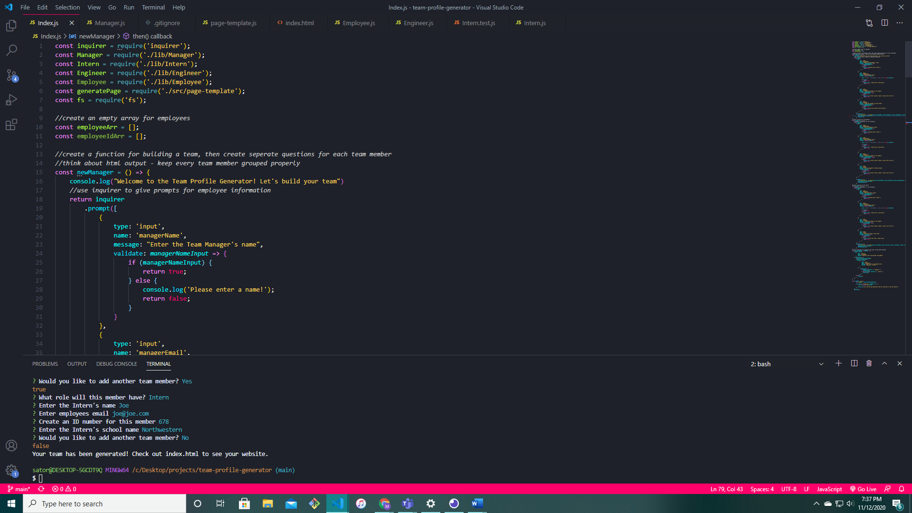

  # Team-Profile-Generator 

  ## Description 

  This project is intended for creatinga database to save details of team members for projects. Type the name, email, and any role-specific questions into our prompts, and you will instantly get a sleek  ready-to-deploy HTML with you members information.

  ## Table of Contents (Optional)

* [Installation](#installation)
* [Usage](#usage)
* [Credits](#credits)
* [License](#license)
* [Directory Structure](#director-structure)
* [Requirements](#requirements)
* [User Story](#user-story)

  ## Installation
    npm i jest, npm i inquirer
    

  ## Usage 
Use this any time that you need to store information for a project team.

  ## CREDITS
    

  ## License

MIT

  ## Tests
    npm test

  # Contact Me
Feel free to contact me if you have any questions about this project. I can be reached by email at msatori.code@gmail.com

## Directory Structure: 
        __tests__/            // jest tests
        Employee.test.js
        Engineer.test.js
        Intern.test.js
        Manager.test.js
        dist/                           // rendered output (HTML) and CSS style sheet
        lib/                // classes
        src/                // template helper code
        Index.js            // runs the application

# Requirements:
-Must use Jest and Inquirer
-Run using 'node index.js"
-Needs the following classes 
-name
-id
-email
-getId
-getEmail
-getRole

## User Story:
        AS A manager
        I WANT to generate a webpage that displays my team's basic info
        SO THAT I have quick access to their emails and GitHub profiles

        GIVEN a command-line application that accepts user input
        WHEN I am prompted for my team members and their information

        THEN an HTML file is generated that displays a nicely formatted team roster based on user input
        WHEN I click on an email address in the HTML

        THEN my default email program opens and populates the TO field of the email with the address
        WHEN I click on the GitHub username

        THEN that GitHub profile opens in a new tab
        WHEN I start the application

        THEN I am prompted to enter the team manager’s name, employee ID, email address, and office number
        WHEN I enter the team manager’s name, employee ID, email address, and office number

        THEN I am presented with a menu with the option to add an engineer or an intern or to finish building my team
        WHEN I select the engineer option

        THEN I am prompted to enter the engineer’s name, ID, email, and GitHub username, and I am taken back to the menu
        WHEN I select the intern option

        THEN I am prompted to enter the intern’s name, ID, email, and school, and I am taken back to the menu

        WHEN I decide to finish building my team
        THEN I exit the application, and the HTML is generated